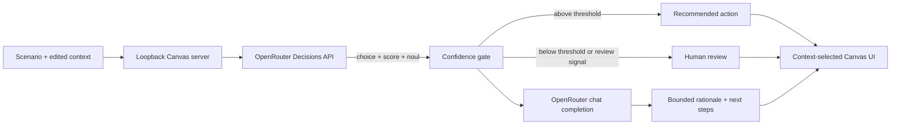

# Decision Kit

Decision Kit is a public GitHub Copilot Canvas demonstration for making fast, inspectable decisions from real context. TypeSafe AI's Jev model chooses a typed branch and exposes its probabilities. A separate chat model explains that bounded result and proposes next steps without changing it.



## What the workbench demonstrates

The Canvas offers incident response, feature prioritization, and customer escalation presets. You can select a scenario, edit its context, and watch two explicit stages progress through Server-Sent Events.

Jev is not a chatbot. One request asks three independent questions using TypeSafe's `choice`, `score`, and `noul` primitives. The result includes the selected branch, option probabilities, confidence, urgency score, and latency. Decision Kit applies a `0.72` confidence threshold and an explicit human-review signal. Below the threshold, it withholds automated certainty and routes the case to a human.

The LLM receives the source context and Jev's bounded result only after that gate is computed. It writes a concise rationale and next-step plan, but it cannot invisibly replace the branch, probabilities, score, or review requirement. The interface labels Jev output as authoritative and the LLM narrative as explanatory.

The UI selects from a small vocabulary instead of rendering every possible panel: urgency signal, option distribution, confidence gate, recommended action, human review, and audit trace.

## Setup

Requirements:

- GitHub Copilot CLI with project extension Canvas support
- Node.js 20 or newer for local tests
- An OpenRouter account for live requests

Environment variables:

| Name | Purpose | Default |
|---|---|---|
| `OPENROUTER_API_KEY` | Authorizes server-side OpenRouter calls. Requested by the extension and read only from `process.env`. | None |
| `OPENROUTER_JEV_MODEL` | Overrides the typed decision model. | `~typesafe/jev-latest` |
| `OPENROUTER_LLM_MODEL` | Overrides the explanatory chat model. | `openai/gpt-4.1-mini` |

Do not put credentials in the repository. The extension requests `OPENROUTER_API_KEY` through the Copilot SDK's `requestedEnvironmentVariables` flow. If the key is absent or access is denied, the extension retries without the secret and remains usable in clearly labeled deterministic demo mode. A failed live request remains an explicit error; it does not fall back to a fixture.

## Open and use the Canvas

The project extension is discovered from `.github/extensions/decision-kit/extension.mjs`.

1. Open this repository in a Copilot project session.
2. Reload extensions after changing extension files.
3. Ask Copilot to open the `decision-kit` Canvas, or use the Canvas catalog.
4. Pick a preset, edit the context, and select **Run decision**.

Host integrations can invoke `run_preset` and `reset_state`. Both actions validate inputs with JSON Schema. The renderer communicates only with its per-instance HTTP server on `127.0.0.1` using an ephemeral port.

## Passive delivery nudge and evaluations

The first delivery slice is a **possible polish-loop nudge**, independent of the Canvas and
OpenRouter. It requires no self-report, feedback form, model call, or API key. It does not
change Jev decisions or grant execution permissions.

The repository hook in `.github/hooks/decision-kit.json` uses Copilot's documented
[`postToolUse` event and `additionalContext` output](https://docs.github.com/en/copilot/reference/hooks-reference).
On a host that supports that output, the reminder goes to the agent after a successful tool
call, not to a user approval dialog. Start a new host session after installing the hook.
Node.js 20+ and Git must be available to the hook process.

### What triggers it

Three narrow spacing or corner-radius replacements in the same file, within the last ten
successful tool observations and fifteen minutes, produce at most one reminder per session.
The agent is asked to check the **existing agreed outcome**, preserve necessary usability
and accessibility work, and verify the current slice before the next authorized commit or PR.
The hook never declares work complete, changes the contract, commits, opens a PR, or deploys.

The classifier supports `edit` and `str_replace_editor` replacement arguments (`path` or
`file_path`, `old_str`/`new_str` or `oldString`/`newString`, including JSON-encoded arguments).
It recognizes only whole snippets of spacing or radius declarations in CSS, SCSS, HTML,
JavaScript, and JSX/TSX files. Contrast, focus, mixed behavior changes, failed edits, and
unsupported patches do not qualify. Larger replacements and `apply_patch` are deliberately
not inferred to be cosmetic. Spacing can still be important: the nudge is advisory, not a
finding of wasted work. These thresholds are initial heuristics, not calibrated facts.

Set `DECISION_KIT_DELIVERY_MODE` in the host environment:

| Mode | Behavior |
|---|---|
| `nudge` (default) | Observe and output at most one advisory reminder per session. |
| `observe` | Record candidate signals without injecting a reminder. |
| `off` | Do not collect or output anything. |

You can also disable this hook file with its top-level `disableAllHooks` setting.
Missing or incompatible host events mean reduced coverage, not proof that no drift occurred.
The implementation is tested with documented payloads; live host delivery is not verified by
the unit tests. There is no automatic cross-host installation or device synchronization.

### Local observations and privacy

State lives in `decision-kit/` inside the current worktree's Git metadata directory, outside
tracked files. It contains hashed session IDs and relative file identifiers, event timestamps,
bounded recent event categories, counts, and hook processing time. Hashes are identifiers,
not anonymization. Prompts, source text, tool results, credentials, and raw file paths are
not persisted or sent over the network.

State is isolated by worktree and session. Atomic writes and a per-session lock prevent
duplicate nudges from overlapping calls; a contended lock skips the observation rather than
waiting. Unsupported, stale, or same-timestamp duplicate events are conservatively skipped.
A killed process can leave a lock; after stopping the host, remove the matching `.lock`
directory to resume observation. Corrupt state is not silently reset and re-nudged.

There is no automatic retention cleanup in this slice. After stopping the host, deleting
`decision-kit/` from the directory reported by `git rev-parse --absolute-git-dir` clears these
observations and reminder suppression. Do not delete the Git metadata directory itself.
Cloud-agent sandbox data is ephemeral and is not uploaded.

### Run the targeted evaluations

```text
npm run eval:delivery
npm run delivery:report
```

The eval suite replays synthetic positive and negative cases and tests the outcome evaluator's
guardrails. It is a regression baseline, **not evidence of faster or better real delivery**.
The report summarizes local observations and nudge outputs. It leaves cost, verified delivery
time, quality, and human attention as `null`: these hooks do not provide those facts.
Nudge output is not proof of host receipt, agent compliance, or human attention saved.
Reported hook time excludes process startup and final persistence.

`delivery-evaluation.mjs` exports `evaluateDeliveryOutcomes({ policy, slices })` for future
passive outcome adapters. No user data-entry step or live experiment is installed.
Its input contract is:

| Input | Required evidence |
|---|---|
| Policy | `id`, `fixedAt` epoch milliseconds, `primaryMetric` (`costUsd` or `deliveryMs`), `minimumPerGroup` (at least two), positive `minimumImprovement`, positive `followupMs`, and `maxRegression` for every metric. Improvement and regression limits use each metric's absolute units. |
| Slice identity | Unique `id`, `policyId`, `group` (`control` or `nudge`), `scopeClass`, original `contractVersion`, `startedAt` epoch milliseconds, and `scopeChanged`. Fix the policy before any slice begins and retain the original contract. |
| Outcome | `costUsd` including the kit, verification, and retries; `costIncludesKit`; elapsed commitment-to-verified-delivery `deliveryMs`; `acceptancePassed`; `reworkCount`; linked `defectCount`; `interruptions`; and elapsed post-delivery `followupMs`. Use `null` for unknown metric, acceptance, or follow-up evidence. |

Trusted adapters must read acceptance and external delivery state independently; agent
completion claims are not verification. The evaluator validates the record structure, not
the truth of supplied evidence. Include **all** enrolled slices, including incomplete ones.
Do not label session activity as a completed slice or populate unknown values with zero.

The evaluator compares one task class, preserves incomplete records, checks follow-up
coverage and scope changes, and reports each metric separately. A faster result cannot hide
higher cost, more rework or defects, or more interruptions. Too little evidence cannot pass.
Even a promising comparison is labeled **association**, never causation; automatic promotion
is always disabled. Sample-size limits are reporting gates, not a statistical power analysis.

The next evidence boundary is passive contract/acceptance, total-cost, delivery-state, and
follow-up defect adapters. An approved randomized slice-level experiment and uncertainty
analysis are still needed before claiming causal improvement or no material harm. Nothing
in this release automatically assigns experiments, weakens safety checks, or claims that
shipping has improved.

## Requirements and ticketing skills

A focused set of [Matt Pocock's skills](https://github.com/mattpocock/skills) is installed in `.github/skills/` for Copilot hosts that support repository skills. The set includes the supporting files needed by these skills:

| Skill | Purpose |
|---|---|
| `setup-matt-pocock-skills` | Confirm the issue tracker, triage labels, and domain document layout. |
| `wayfinder` | Map open questions as decision tickets before committing to a solution. |
| `grill-with-docs` | Clarify requirements with the user and record agreed terms and decisions. |
| `to-spec` | Turn an agreed conversation into a specification on the issue tracker. |
| `to-tickets` | Propose testable, end-to-end tickets with acceptance criteria and blockers. |
| `triage` | Review tickets and identify missing information or readiness for work. |
| `grilling`, `domain-modeling`, `research`, `prototype` | Support interviews, shared terms, evidence gathering, and design validation. |

### First use

1. Start a new Copilot session in this checkout so the host can discover the skills. Ask it to use a skill by name; slash-command availability depends on the host.
2. Before declaring setup complete, check the repository's labels against the configured triage labels and the `wayfinder:map`, `wayfinder:research`, `wayfinder:prototype`, `wayfinder:grilling`, and `wayfinder:task` labels. Ask for explicit approval before creating any missing labels. If labels are missing and approval is not given, report that setup is pending. Use available GitHub tools; the `gh` CLI is not required.
3. Read [tracker operations](docs/agents/issue-tracker.md), [triage labels](docs/agents/triage-labels.md), and [domain document rules](docs/agents/domain.md) before using the workflow. No tickets or labels are created by this installation.
4. Use `wayfinder` to find the decisions needed for portable rules, evaluations, traces, and specification adherence. This is decision discovery, not implementation.
5. Use `grill-with-docs` to resolve requirements, then `to-spec` to capture the agreed scope and test boundaries.
6. Use `to-tickets` to review the ticket breakdown before publishing.

You can edit `docs/agents/*.md` later. Re-run `setup-matt-pocock-skills` with the user when changing the tracker or restarting setup. Create the glossary and architecture decision records only after agreeing on terms or decisions; no placeholders are required.

These are agent workflow instructions, not Canvas classifiers or an evaluation engine. They do not add cross-workspace installation or device-profile sync. A checkout on another device carries the same skill files, but its host must support skill discovery and have its own tracker access.

### Source and updates

The installed files come from upstream commit [`4588b32ecab9ecc9fc8cc6b6c5e7d675b6004b0d`](https://github.com/mattpocock/skills/tree/4588b32ecab9ecc9fc8cc6b6c5e7d675b6004b0d). They were installed from that commit's archive with `skills` CLI version `1.7.0` and placed in `.github/skills/`. No runtime dependency was added.

The skill folders are unmodified upstream copies. Review upstream changes before replacing them; do not automatically update to the latest revision. Retain the upstream [MIT license](.github/skills/LICENSE) when copying or updating the skills.

## Data handoff skill

Ask Copilot: “Use data-handoff for the ticket-to-summary boundary in this codebase.”
The generic [skill](.github/skills/data-handoff/SKILL.md) produces one short handoff
per boundary: Purpose, Input JSON, Output JSON, Field map, and Handling rules.
JSON is canonical; YAML or TypeScript translations are available only on request.
The [template](.github/skills/data-handoff/handoff-template.md) is a synthetic
golden-path demo, not an implemented contract.

Validate a draft with Node.js 20+ (no dependencies or preapproval setup needed):

```sh
node .github/skills/data-handoff/validate-handoff.mjs /absolute/path/to/handoff.md
```

This checks formatting, not whether the code was understood correctly. Unknown
interfaces stay incomplete rather than gaining invented JSON. Review semantics
with the separate [rubric and five eval cards](.github/skills/data-handoff/evals.json).
Give engineers only the handoff, not evaluation scores. Validator tests run with
`npm test`, or `node --test test/data-handoff.test.mjs` for a focused check.

## Model and API references

Verified against the official OpenRouter documentation on 2026-09-27:

- Jev alias: [`~typesafe/jev-latest`](https://openrouter.ai/docs/guides/community/jev), currently tracking the Jev 1.13 release family
- Pinned Jev release: `typesafe/jev-1.13`; TypeSafe identifies the current latest snapshot as Jev 1.13.0
- Decisions endpoint: `POST https://openrouter.ai/api/alpha/decisions`
- Typed primitives: `choice`, `score`, and `noul`
- Chat endpoint: `POST https://openrouter.ai/api/v1/chat/completions`

The latest alias is convenient for this demonstration. Production systems should pin a tested Jev release when thresholds are calibrated against labeled data.

## Development

```text
npm test
npm run check
```

Tests use Node's built-in runner and make no network calls. They cover request shaping, scenario validation, typed response interpretation, low-confidence human review, explicit review signals, malformed provider responses, and the narrative boundary.

## License

[MIT](LICENSE)
