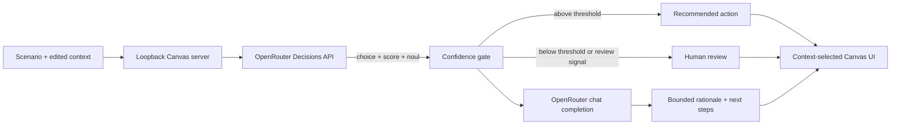

# Decision Kit

Decision Kit is a public GitHub Copilot Canvas demonstration for making fast, inspectable decisions from real context. TypeSafe AI's Jev model chooses a typed branch and exposes its probabilities. A separate chat model explains that bounded result and proposes next steps without changing it.



## What the workbench demonstrates

The Canvas offers incident response, feature prioritization, and customer escalation presets. You can select a scenario, edit its context, and watch two explicit stages progress through Server-Sent Events.

Jev is not a chatbot. One request asks three independent questions using TypeSafe's `choice`, `score`, and `noul` primitives. The result includes the selected branch, option probabilities, confidence, urgency score, and latency. Decision Kit applies a `0.72` confidence threshold and an explicit human-review signal. Below the threshold, it withholds automated certainty and routes the case to a human.

The LLM receives the source context and Jev's bounded result only after that gate is computed. It writes a concise rationale and next-step plan, but it cannot invisibly replace the branch, probabilities, score, or review requirement. The interface labels Jev output as authoritative and the LLM narrative as explanatory.

The UI selects from a small vocabulary instead of rendering every possible panel: urgency signal, option distribution, confidence gate, recommended action, human review, and audit trace.

## Setup

Requirements:

- GitHub Copilot CLI with project extension Canvas support
- Node.js 20 or newer for local tests
- An OpenRouter account for live requests

Environment variables:

| Name | Purpose | Default |
|---|---|---|
| `OPENROUTER_API_KEY` | Authorizes server-side OpenRouter calls. Requested by the extension and read only from `process.env`. | None |
| `OPENROUTER_JEV_MODEL` | Overrides the typed decision model. | `~typesafe/jev-latest` |
| `OPENROUTER_LLM_MODEL` | Overrides the explanatory chat model. | `openai/gpt-4.1-mini` |

Do not put credentials in the repository. The extension requests `OPENROUTER_API_KEY` through the Copilot SDK's `requestedEnvironmentVariables` flow. If the key is absent or access is denied, the extension retries without the secret and remains usable in clearly labeled deterministic demo mode. A failed live request remains an explicit error; it does not fall back to a fixture.

## Open and use the Canvas

The project extension is discovered from `.github/extensions/decision-kit/extension.mjs`.

1. Open this repository in a Copilot project session.
2. Reload extensions after changing extension files.
3. Ask Copilot to open the `decision-kit` Canvas, or use the Canvas catalog.
4. Pick a preset, edit the context, and select **Run decision**.

Host integrations can invoke `run_preset` and `reset_state`. Both actions validate inputs with JSON Schema. The renderer communicates only with its per-instance HTTP server on `127.0.0.1` using an ephemeral port.

## Requirements and ticketing skills

A focused set of [Matt Pocock's skills](https://github.com/mattpocock/skills) is installed in `.github/skills/` for Copilot hosts that support repository skills. The set includes the supporting files needed by these skills:

| Skill | Purpose |
|---|---|
| `setup-matt-pocock-skills` | Confirm the issue tracker, triage labels, and domain document layout. |
| `wayfinder` | Map open questions as decision tickets before committing to a solution. |
| `grill-with-docs` | Clarify requirements with the user and record agreed terms and decisions. |
| `to-spec` | Turn an agreed conversation into a specification on the issue tracker. |
| `to-tickets` | Propose testable, end-to-end tickets with acceptance criteria and blockers. |
| `triage` | Review tickets and identify missing information or readiness for work. |
| `grilling`, `domain-modeling`, `research`, `prototype` | Support interviews, shared terms, evidence gathering, and design validation. |

### First use

1. Start a new Copilot session in this checkout so the host can discover the skills. Ask it to use a skill by name; slash-command availability depends on the host.
2. Run `setup-matt-pocock-skills`. Tracker configuration is **not yet complete**: confirm GitHub Issues or another tracker, and the triage label names. The setup skill proposes domain documentation locations and shows the configuration for approval before writing it.
3. Use `wayfinder` to find the decisions needed for portable rules, evaluations, traces, and specification adherence. This is decision discovery, not implementation.
4. Use `grill-with-docs` to resolve requirements, then `to-spec` to capture the agreed scope and test boundaries.
5. Use `to-tickets` to review the ticket breakdown before publishing. No tickets or labels are created by this installation.

These are agent workflow instructions, not Canvas classifiers or an evaluation engine. They do not add cross-workspace installation or device-profile sync. A checkout on another device carries the same skill files, but its host must support skill discovery and have its own tracker access.

### Source and updates

The installed files come from upstream commit [`4588b32ecab9ecc9fc8cc6b6c5e7d675b6004b0d`](https://github.com/mattpocock/skills/tree/4588b32ecab9ecc9fc8cc6b6c5e7d675b6004b0d). They were installed from that commit's archive with `skills` CLI version `1.7.0` and placed in `.github/skills/`. No runtime dependency was added.

The skill folders are unmodified upstream copies. Review upstream changes before replacing them; do not automatically update to the latest revision. Retain the upstream [MIT license](.github/skills/LICENSE) when copying or updating the skills.

## Model and API references

Verified against the official OpenRouter documentation on 2026-09-27:

- Jev alias: [`~typesafe/jev-latest`](https://openrouter.ai/docs/guides/community/jev), currently tracking the Jev 1.13 release family
- Pinned Jev release: `typesafe/jev-1.13`; TypeSafe identifies the current latest snapshot as Jev 1.13.0
- Decisions endpoint: `POST https://openrouter.ai/api/alpha/decisions`
- Typed primitives: `choice`, `score`, and `noul`
- Chat endpoint: `POST https://openrouter.ai/api/v1/chat/completions`

The latest alias is convenient for this demonstration. Production systems should pin a tested Jev release when thresholds are calibrated against labeled data.

## Development

```text
npm test
npm run check
```

Tests use Node's built-in runner and make no network calls. They cover request shaping, scenario validation, typed response interpretation, low-confidence human review, explicit review signals, malformed provider responses, and the narrative boundary.

## License

[MIT](LICENSE)
